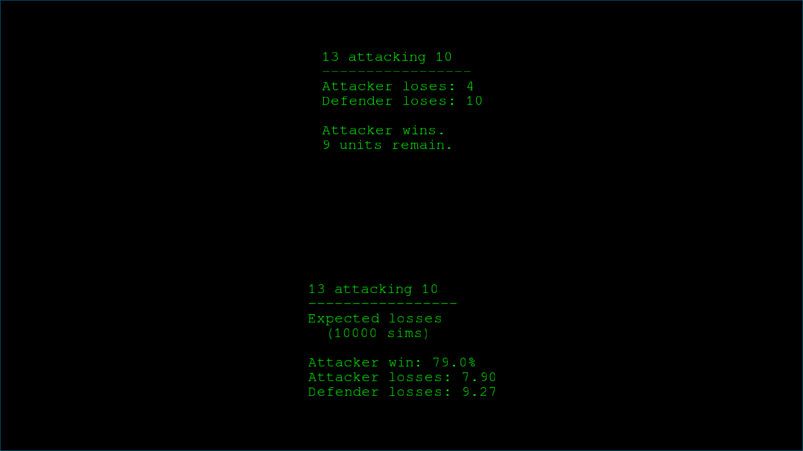

# About

This program a simple dice roll simulator for the original version of the game
**Risk**. It saves you having to roll dice. It can simulate single attacks
(i.e., 3v2, 3v1, 2v2, 2v1, 1v2, and 1v1) or entire battles (e.g., 15v17) by
repeatedly simulating single attacks.

It is meant to present a simplified view. If replacing having to tediously roll
dice for each attack, just hitting the space bar will present a simulation for
all six single attack configurations.

This program will also report statistics about single attacks and entire
battles, if desired. Statistics are generated by simulation 10k attacks/battles.
Expected losses, winners, and the win rate are reported.

# Screenshots

# Caveats

Battle simulators assume that:

  1. The number of dice used by both attacker and defender are decided prior to
     rolling. (This rule is described as the 'original' and 'British' and
     'American' and 'updated' rule, in contrast with the 'Dutch' rule in which
     the defender chooses to roll each die separately.)

  2. Both attacker and defender use the maximum number of dice they possibly
     can (which is advantageous given the prior assumption).

  3. Battles are not terminated early.

The accuracy of simulations has been compared with the following publication to
ensure accuracy.

    Osborne, Jason A. "Markov chains for the RISK board game revisited."
    Mathematics magazine 76.2 (2003): 129-135.
    https://doi.org/10.1080/0025570X.2003.11953165

However, the implementation should not be relied on without scrutiny.

# License and Copying

All materials herein which may be copywrited, where applicable, are. Copyright
2019 Hal Clark. See [LICENSE.txt] for details about the license.

All liability is herefore disclaimed. The person(s) who use this source and/or
software do so strictly under their own volition. They assume all associated
liability for use and misuse, including but not limited to damages, harm,
injury, and death which may result, including but not limited to that arising
from unforeseen or unanticipated implementation defects.

# Dependencies

SFML, CMake, and a C++ compiler.

# Installation

This project uses CMake. Use the usual commands to compile:

     $>  cd /path/to/source/directory
     $>  mkdir build && cd build/
     $>  cmake -DCMAKE_INSTALL_PREFIX=/usr ../

then either

     $>  make

or

     $>  make && sudo make install

The script `compile.sh` will perform the above, but will not install anything.

